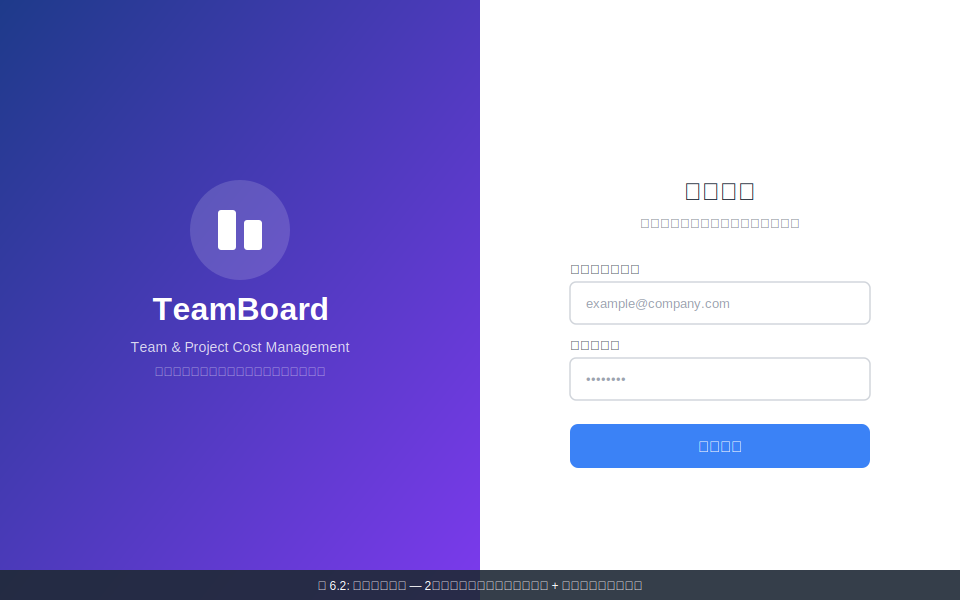
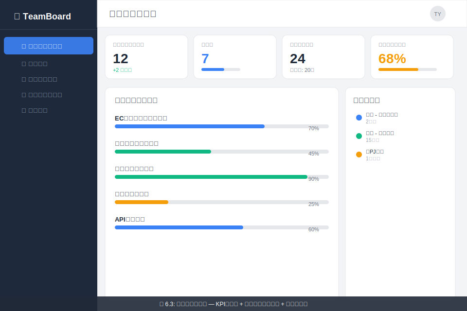
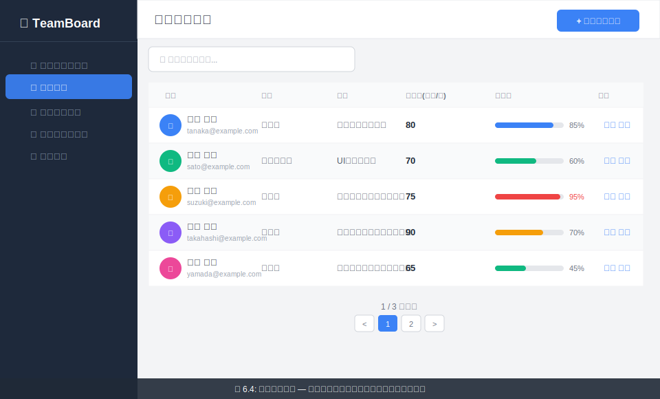
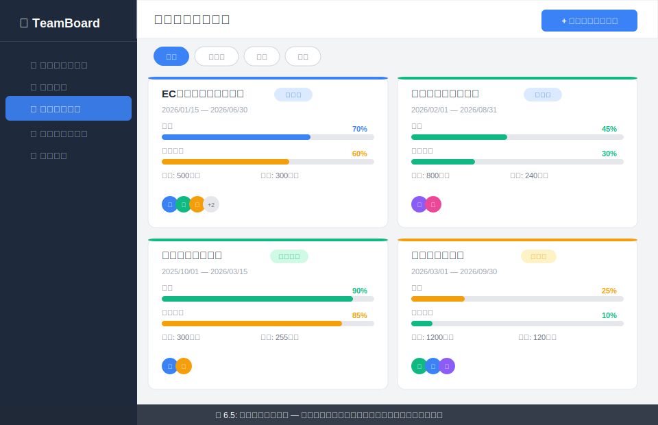
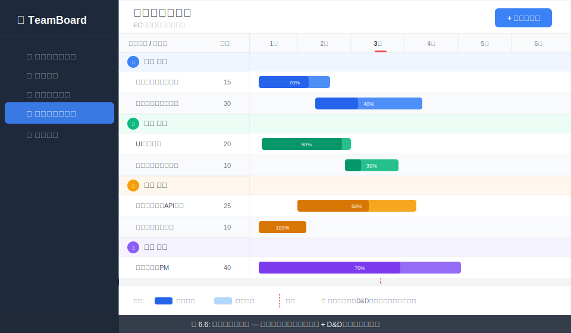
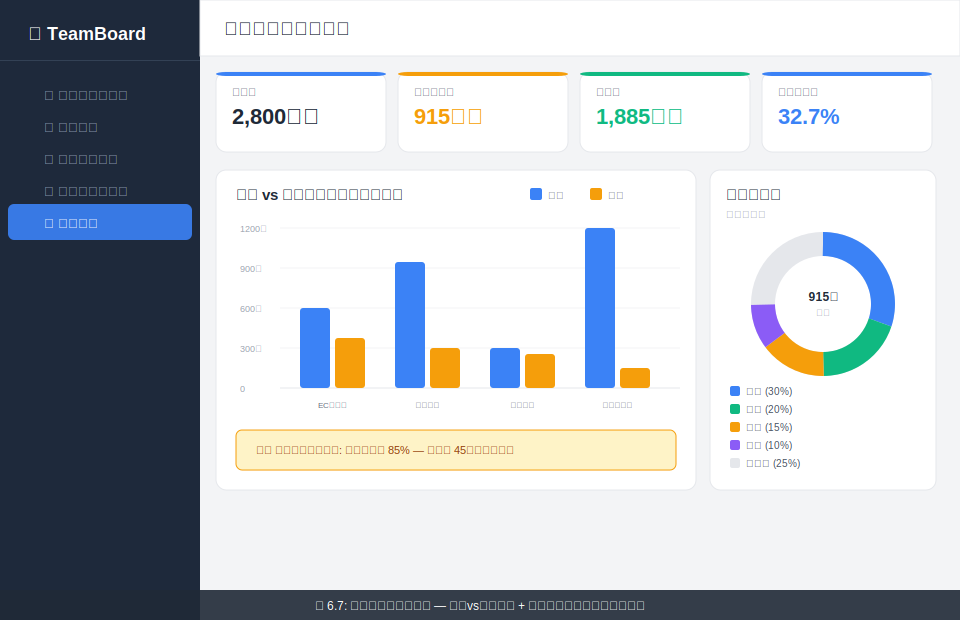

# TeamBoard 実装計画書

## 概要

本ドキュメントは、TeamBoard アーキテクチャ設計書 v2.0 に基づく詳細な実装計画です。
5つの開発フェーズに分けて、全タスクを定義します。

---

## 画面イメージ一覧

### 図 6.2: ログイン画面



2カラムレイアウト。左側にTeamBoardブランドイメージ（グラデーション背景）、右側にメールアドレス・パスワード入力フォーム。

### 図 6.3: ダッシュボード



KPIカード（総プロジェクト数・進行中・総メンバー数・予算消化率）、プロジェクト進捗リスト、最近の更新履歴を表示。

### 図 6.4: メンバー一覧



テーブル形式でメンバー情報を表示。アバター、名前、部署、役割、コスト（万円/月）、稼働率（プログレスバー）、操作ボタン。

### 図 6.5: プロジェクト一覧



カード形式でプロジェクトを表示。各カードに進捗バー、予算消化率、メンバーアバター群、ステータスバッジ。

### 図 6.6: ガントチャート



メンバー別グルーピングのタイムライン表示。タスクバーは色分け・進捗率オーバーレイ付き。D&Dで移動・並び替え可能。

### 図 6.7: 予算ダッシュボード



予算サマリーKPIカード、プロジェクト別の予算vs実績バーチャート、メンバー別コスト内訳ドーナツチャート。

---

## 技術スタック

| レイヤー | 技術 |
|---|---|
| フロントエンド | React 18 + TypeScript 5.x + Vite 5.x |
| 状態管理 | TanStack Query 5.x (サーバー状態) + Zustand 4.x (クライアント状態) |
| UIライブラリ | Recharts 2.x (グラフ) + dnd-kit 6.x (D&D) |
| バックエンド | Python 3.12 + FastAPI 0.110+ |
| ODM/DB | Motor 3.x + Beanie 1.x + MongoDB 7.0 |
| 認証 | python-jose 3.x (JWT) |

---

## ディレクトリ構成（最終形）

```
teamboard/
├── frontend/
│   ├── index.html
│   ├── package.json
│   ├── tsconfig.json
│   ├── vite.config.ts
│   └── src/
│       ├── main.tsx
│       ├── App.tsx
│       ├── api/
│       │   ├── client.ts              # Axios インスタンス + インターセプター
│       │   ├── auth.ts                # 認証API
│       │   ├── members.ts             # メンバーAPI
│       │   ├── projects.ts            # プロジェクトAPI
│       │   └── tasks.ts               # タスクAPI
│       ├── components/
│       │   ├── layout/
│       │   │   ├── Sidebar.tsx         # サイドバーナビゲーション
│       │   │   ├── Header.tsx          # ヘッダーバー
│       │   │   └── MainLayout.tsx      # メインレイアウト
│       │   ├── common/
│       │   │   ├── KpiCard.tsx         # KPIカード
│       │   │   ├── ProgressBar.tsx     # プログレスバー
│       │   │   ├── StatusBadge.tsx     # ステータスバッジ
│       │   │   ├── DataTable.tsx       # 汎用テーブル
│       │   │   └── ConfirmDialog.tsx   # 確認ダイアログ
│       │   ├── members/
│       │   │   ├── MemberTable.tsx     # メンバーテーブル
│       │   │   ├── MemberForm.tsx      # メンバー登録/編集フォーム
│       │   │   └── UtilizationBar.tsx  # 稼働率バー
│       │   ├── projects/
│       │   │   ├── ProjectCard.tsx     # プロジェクトカード
│       │   │   ├── ProjectForm.tsx     # プロジェクト作成/編集フォーム
│       │   │   └── BudgetGauge.tsx     # 予算消化ゲージ
│       │   ├── gantt/
│       │   │   ├── GanttChart.tsx      # ガントチャート本体
│       │   │   ├── GanttRow.tsx        # ガント行（タスクバー）
│       │   │   ├── GanttHeader.tsx     # タイムラインヘッダー
│       │   │   ├── TaskBar.tsx         # ドラッグ可能タスクバー
│       │   │   └── MemberGroup.tsx     # メンバー別グルーピング
│       │   └── budget/
│       │       ├── BudgetVsActual.tsx  # 予算vs実績グラフ
│       │       ├── CostBreakdown.tsx   # コスト内訳
│       │       └── BudgetSummary.tsx   # 予算サマリー
│       ├── pages/
│       │   ├── LoginPage.tsx           # ログイン画面
│       │   ├── DashboardPage.tsx       # ダッシュボード
│       │   ├── MembersPage.tsx         # メンバー一覧
│       │   ├── ProjectsPage.tsx        # プロジェクト一覧
│       │   ├── ProjectDetailPage.tsx   # プロジェクト詳細（ガント）
│       │   └── BudgetPage.tsx          # 予算ダッシュボード
│       ├── hooks/
│       │   ├── useAuth.ts             # 認証フック
│       │   ├── useMembers.ts          # メンバーCRUDフック
│       │   ├── useProjects.ts         # プロジェクトCRUDフック
│       │   └── useTasks.ts            # タスクCRUDフック
│       ├── stores/
│       │   ├── authStore.ts           # 認証ストア (Zustand)
│       │   └── uiStore.ts            # UI状態ストア (Zustand)
│       ├── types/
│       │   ├── auth.ts               # 認証型定義
│       │   ├── member.ts             # メンバー型定義
│       │   ├── project.ts            # プロジェクト型定義
│       │   └── task.ts               # タスク型定義
│       └── styles/
│           └── index.css             # グローバルスタイル (Tailwind CSS)
├── backend/
│   ├── requirements.txt
│   ├── app/
│   │   ├── main.py                   # FastAPIエントリーポイント
│   │   ├── config.py                 # 環境変数・設定
│   │   ├── routers/
│   │   │   ├── auth.py               # 認証ルーター
│   │   │   ├── members.py            # メンバールーター
│   │   │   ├── projects.py           # プロジェクトルーター
│   │   │   └── tasks.py              # タスクルーター
│   │   ├── models/
│   │   │   ├── user.py               # User Pydanticモデル
│   │   │   ├── member.py             # Member Pydanticモデル
│   │   │   ├── project.py            # Project Pydanticモデル
│   │   │   └── task.py               # Task Pydanticモデル
│   │   ├── services/
│   │   │   ├── auth_service.py       # 認証ビジネスロジック
│   │   │   ├── member_service.py     # メンバービジネスロジック
│   │   │   ├── project_service.py    # プロジェクトビジネスロジック
│   │   │   ├── task_service.py       # タスクビジネスロジック
│   │   │   └── cost_service.py       # コスト計算ロジック
│   │   ├── db/
│   │   │   ├── database.py           # MongoDB接続初期化
│   │   │   └── seed.py               # 初期データ投入
│   │   └── auth/
│   │       ├── jwt_handler.py        # JWTトークン生成・検証
│   │       ├── password.py           # パスワードハッシュ
│   │       └── dependencies.py       # 認証依存性（get_current_user等）
│   └── tests/
│       ├── test_auth.py
│       ├── test_members.py
│       ├── test_projects.py
│       └── test_tasks.py
└── README.md
```

---

## Phase 1: 基盤構築（2週間）

### 1.1 プロジェクト初期化

| # | タスク | 成果物 |
|---|---|---|
| 1.1.1 | Vite + React + TypeScript プロジェクト作成 | `frontend/` 配下の初期ファイル群 |
| 1.1.2 | ESLint + Prettier 設定 | `.eslintrc.cjs`, `.prettierrc` |
| 1.1.3 | Tailwind CSS 導入・設定 | `tailwind.config.js`, `postcss.config.js` |
| 1.1.4 | FastAPI プロジェクト構造作成 | `backend/app/` 配下の初期ファイル群 |
| 1.1.5 | `requirements.txt` 作成（全依存パッケージ記載） | `backend/requirements.txt` |
| 1.1.6 | MongoDB 接続モジュール実装（Motor + Beanie初期化） | `backend/app/db/database.py` |
| 1.1.7 | CORS 設定（開発環境用 `localhost:5173` 許可） | `backend/app/main.py` |
| 1.1.8 | 環境変数管理（`.env` + `config.py`） | `backend/app/config.py`, `.env.example` |

### 1.2 認証機能

| # | タスク | 成果物 |
|---|---|---|
| 1.2.1 | User モデル定義（Beanie Document） | `backend/app/models/user.py` |
| 1.2.2 | パスワードハッシュユーティリティ（bcrypt） | `backend/app/auth/password.py` |
| 1.2.3 | JWT トークン生成・検証 | `backend/app/auth/jwt_handler.py` |
| 1.2.4 | 認証依存性（`get_current_user`, ロールチェック） | `backend/app/auth/dependencies.py` |
| 1.2.5 | 認証ルーター実装 | `backend/app/routers/auth.py` |

**APIエンドポイント:**

| メソッド | パス | 説明 |
|---|---|---|
| POST | `/api/auth/login` | メールアドレス + パスワードでログイン → JWT返却 |
| GET | `/api/auth/me` | 現在のユーザー情報取得 |
| POST | `/api/auth/register` | 新規ユーザー登録（admin のみ） |

### 1.3 メンバー CRUD

| # | タスク | 成果物 |
|---|---|---|
| 1.3.1 | Member モデル定義 | `backend/app/models/member.py` |
| 1.3.2 | Member サービス層 | `backend/app/services/member_service.py` |
| 1.3.3 | Member ルーター実装 | `backend/app/routers/members.py` |
| 1.3.4 | 初期シードデータ作成 | `backend/app/db/seed.py` |

**Member モデル:**

```python
class Member(Document):
    name: str                    # 氏名
    email: str                   # メールアドレス
    department: str              # 部署
    role: str                    # 役割（開発者/デザイナー/PM等）
    cost_per_month: float        # 万円/人月
    avatar_color: str            # アバター背景色
    is_active: bool = True       # 有効フラグ
    created_at: datetime
    updated_at: datetime
```

**APIエンドポイント:**

| メソッド | パス | 説明 |
|---|---|---|
| GET | `/api/members` | メンバー一覧取得 |
| POST | `/api/members` | メンバー登録 |
| GET | `/api/members/{id}` | メンバー詳細取得 |
| PUT | `/api/members/{id}` | メンバー更新 |
| DELETE | `/api/members/{id}` | メンバー削除 |
| GET | `/api/members/{id}/utilization` | メンバー稼働率取得 |

### 1.4 フロントエンド基盤

| # | タスク | 成果物 |
|---|---|---|
| 1.4.1 | API クライアント（Axios + インターセプター） | `frontend/src/api/client.ts` |
| 1.4.2 | 認証ストア（Zustand） | `frontend/src/stores/authStore.ts` |
| 1.4.3 | React Router 設定（ルーティング） | `frontend/src/App.tsx` |
| 1.4.4 | メインレイアウト（サイドバー + ヘッダー） | `frontend/src/components/layout/` |
| 1.4.5 | ログインページ実装 | `frontend/src/pages/LoginPage.tsx` |
| 1.4.6 | 認証ガード（ProtectedRoute） | `frontend/src/App.tsx` |

**ログイン画面の仕様（[図6.2](#図-62-ログイン画面)参照）:**

<details><summary>画面イメージを表示</summary>


</details>

- 2カラムレイアウト：左=ブランドイメージ（グラデーション背景 + アイコン）、右=ログインフォーム
- Email + Password 入力フィールド
- 「ログイン」ボタン（青系プライマリカラー）
- バリデーションエラー表示

---

## Phase 2: コア機能（3週間）

### 2.1 プロジェクト CRUD（バックエンド）

| # | タスク | 成果物 |
|---|---|---|
| 2.1.1 | Project モデル定義（Task 埋め込み） | `backend/app/models/project.py`, `backend/app/models/task.py` |
| 2.1.2 | Project サービス層 | `backend/app/services/project_service.py` |
| 2.1.3 | Project ルーター実装 | `backend/app/routers/projects.py` |
| 2.1.4 | Task サービス層 | `backend/app/services/task_service.py` |
| 2.1.5 | Task ルーター実装 | `backend/app/routers/tasks.py` |

**Project モデル:**

```python
class Task(BaseModel):
    task_id: str                 # タスクID (UUID)
    title: str                   # タスク名
    assignee_id: str             # 担当者ID (Member参照)
    man_days: float              # 人日
    progress: int                # 進捗率 (0-100)
    start_date: date             # 開始日
    end_date: date               # 終了日
    sort_order: int              # 表示順序
    status: str                  # not_started / in_progress / completed

class Project(Document):
    name: str                    # プロジェクト名
    description: str             # 説明
    budget: float                # 予算（万円）
    status: str                  # planning / active / completed / on_hold
    start_date: date             # 開始日
    end_date: date               # 終了日
    tasks: List[Task] = []       # 埋め込みタスク
    created_at: datetime
    updated_at: datetime
```

**APIエンドポイント:**

| メソッド | パス | 説明 |
|---|---|---|
| GET | `/api/projects` | プロジェクト一覧 |
| POST | `/api/projects` | プロジェクト作成 |
| GET | `/api/projects/{id}` | プロジェクト詳細 |
| PUT | `/api/projects/{id}` | プロジェクト更新 |
| DELETE | `/api/projects/{id}` | プロジェクト削除 |
| GET | `/api/projects/{id}/cost` | コスト計算結果 |
| GET | `/api/projects/{id}/budget-vs-actual` | 予算vs実績 |
| POST | `/api/projects/{id}/tasks` | タスク追加 |
| PUT | `/api/projects/{id}/tasks/{task_id}` | タスク更新 |
| DELETE | `/api/projects/{id}/tasks/{task_id}` | タスク削除 |
| PUT | `/api/projects/{id}/tasks/reorder` | タスク並び替え |
| PUT | `/api/projects/{id}/tasks/{task_id}/assign` | タスクアサイン |

### 2.2 コスト計算ロジック

| # | タスク | 成果物 |
|---|---|---|
| 2.2.1 | コスト計算サービス実装 | `backend/app/services/cost_service.py` |

**計算式:**

```
タスクコスト = (担当者のcost_per_month / 20営業日) × man_days

プロジェクト総コスト = Σ(全タスクのタスクコスト)

月間稼働率 = (該当月のアサイン人日合計 / 20営業日) × 100%
```

### 2.3 フロントエンド - メンバー管理画面

| # | タスク | 成果物 |
|---|---|---|
| 2.3.1 | メンバー API フック（TanStack Query） | `frontend/src/hooks/useMembers.ts` |
| 2.3.2 | メンバーテーブルコンポーネント | `frontend/src/components/members/MemberTable.tsx` |
| 2.3.3 | メンバー登録/編集フォーム（モーダル） | `frontend/src/components/members/MemberForm.tsx` |
| 2.3.4 | 稼働率バー表示 | `frontend/src/components/members/UtilizationBar.tsx` |
| 2.3.5 | メンバー一覧ページ統合 | `frontend/src/pages/MembersPage.tsx` |

**メンバー一覧画面の仕様（[図6.4](#図-64-メンバー一覧)参照）:**

<details><summary>画面イメージを表示</summary>


</details>

- テーブルレイアウト：名前（アバター付き）、部署、役割、コスト（万円/月）、稼働率（プログレスバー）、操作ボタン
- 「+ 新規メンバー」ボタン → モーダルフォーム
- 検索・フィルター機能
- ステータスバッジ（アクティブ/非アクティブ）

### 2.4 フロントエンド - プロジェクト管理画面

| # | タスク | 成果物 |
|---|---|---|
| 2.4.1 | プロジェクト API フック（TanStack Query） | `frontend/src/hooks/useProjects.ts` |
| 2.4.2 | プロジェクトカードコンポーネント | `frontend/src/components/projects/ProjectCard.tsx` |
| 2.4.3 | 予算消化ゲージ | `frontend/src/components/projects/BudgetGauge.tsx` |
| 2.4.4 | プロジェクト作成/編集フォーム | `frontend/src/components/projects/ProjectForm.tsx` |
| 2.4.5 | プロジェクト一覧ページ統合 | `frontend/src/pages/ProjectsPage.tsx` |

**プロジェクト一覧画面の仕様（[図6.5](#図-65-プロジェクト一覧)参照）:**

<details><summary>画面イメージを表示</summary>


</details>

- カード形式の一覧表示
- 各カード：プロジェクト名、ステータスバッジ、期間、進捗バー、予算消化率、メンバーアバター群
- 「+ 新規プロジェクト」ボタン
- ステータスフィルター（全て / 進行中 / 完了 / 保留）

### 2.5 フロントエンド - ダッシュボード

| # | タスク | 成果物 |
|---|---|---|
| 2.5.1 | KPI カードコンポーネント | `frontend/src/components/common/KpiCard.tsx` |
| 2.5.2 | ダッシュボードページ統合 | `frontend/src/pages/DashboardPage.tsx` |

**ダッシュボード画面の仕様（[図6.3](#図-63-ダッシュボード)参照）:**

<details><summary>画面イメージを表示</summary>


</details>

- KPIカード群：総プロジェクト数、進行中プロジェクト、総メンバー数、今月予算消化率
- プロジェクト進捗サマリーリスト
- 直近のアクティビティ

---

## Phase 3: ガントチャート（2週間）

### 3.1 ガントチャート コンポーネント

| # | タスク | 成果物 |
|---|---|---|
| 3.1.1 | タイムラインヘッダー（月/週の目盛り） | `frontend/src/components/gantt/GanttHeader.tsx` |
| 3.1.2 | タスクバーコンポーネント（dnd-kit Draggable） | `frontend/src/components/gantt/TaskBar.tsx` |
| 3.1.3 | ガント行コンポーネント | `frontend/src/components/gantt/GanttRow.tsx` |
| 3.1.4 | メンバー別グルーピング表示 | `frontend/src/components/gantt/MemberGroup.tsx` |
| 3.1.5 | ガントチャート本体（DndContext統合） | `frontend/src/components/gantt/GanttChart.tsx` |
| 3.1.6 | タスク API フック | `frontend/src/hooks/useTasks.ts` |
| 3.1.7 | プロジェクト詳細ページ統合 | `frontend/src/pages/ProjectDetailPage.tsx` |

**ガントチャート画面の仕様（[図6.6](#図-66-ガントチャート)参照）:**

<details><summary>画面イメージを表示</summary>


</details>

- 左ペイン：メンバー名 + タスク一覧（ツリー構造）
- 右ペイン：タイムライン（月単位の横軸）
- タスクバー：色分け（メンバーごと）、進捗率のオーバーレイ表示
- D&D：タスクバーの横方向移動（期間変更）、縦方向移動（並び替え）
- 今日の日付に縦線表示
- メンバー別グルーピング：折りたたみ可能なセクション

### 3.2 D&D イベント処理（バックエンド連携）

| # | タスク | 成果物 |
|---|---|---|
| 3.2.1 | ドラッグ終了時の日付再計算ロジック | `GanttChart.tsx` 内ハンドラー |
| 3.2.2 | 並び替えAPI呼び出し（Optimistic Update） | `useTasks.ts` |
| 3.2.3 | タスク追加/編集ダイアログ | `ProjectDetailPage.tsx` 内 |

---

## Phase 4: 分析機能（2週間）

### 4.1 予算 vs 実績ダッシュボード

| # | タスク | 成果物 |
|---|---|---|
| 4.1.1 | 予算 vs 実績 バーチャート（Recharts） | `frontend/src/components/budget/BudgetVsActual.tsx` |
| 4.1.2 | コスト内訳 パイ/ドーナツチャート | `frontend/src/components/budget/CostBreakdown.tsx` |
| 4.1.3 | 予算サマリーカード | `frontend/src/components/budget/BudgetSummary.tsx` |
| 4.1.4 | 予算ダッシュボードページ統合 | `frontend/src/pages/BudgetPage.tsx` |

**予算ダッシュボード画面の仕様（[図6.7](#図-67-予算ダッシュボード)参照）:**

<details><summary>画面イメージを表示</summary>


</details>

- 上部：予算サマリーKPIカード（総予算、実績コスト、残予算、消化率）
- 中央：予算 vs 実績の棒グラフ（プロジェクト別）
- 下部：コスト内訳（メンバー別/プロジェクト別のドーナツチャート）
- フィルター：期間選択、プロジェクト選択

### 4.2 稼働率分析

| # | タスク | 成果物 |
|---|---|---|
| 4.2.1 | メンバー稼働率APIの拡充（月別推移） | `backend/app/services/member_service.py` |
| 4.2.2 | メンバー一覧の稼働率バー統合 | `MembersPage.tsx` 更新 |
| 4.2.3 | ダッシュボードへの稼働率サマリー追加 | `DashboardPage.tsx` 更新 |

---

## Phase 5: 品質向上（1週間）

### 5.1 バックエンドテスト

| # | タスク | 成果物 |
|---|---|---|
| 5.1.1 | 認証API テスト（pytest + httpx） | `backend/tests/test_auth.py` |
| 5.1.2 | メンバーCRUD テスト | `backend/tests/test_members.py` |
| 5.1.3 | プロジェクト/タスクCRUD テスト | `backend/tests/test_projects.py` |
| 5.1.4 | コスト計算ロジック テスト | `backend/tests/test_tasks.py` |

### 5.2 RBAC（ロールベースアクセス制御）

| # | タスク | 成果物 |
|---|---|---|
| 5.2.1 | ロールチェックミドルウェア完成 | `backend/app/auth/dependencies.py` 更新 |
| 5.2.2 | 各ルーターへの権限デコレーター適用 | 各ルーターファイル更新 |

**権限マトリクス:**

| ロール | メンバー管理 | プロジェクト管理 | タスク管理 | コスト閲覧 |
|---|---|---|---|---|
| admin | 作成/編集/削除 | 作成/編集/削除 | 全操作 | 全プロジェクト |
| manager | 閲覧のみ | 作成/編集 | 全操作 | 担当プロジェクト |
| member | 閲覧のみ | 閲覧のみ | 進捗更新のみ | 担当タスクのみ |

### 5.3 パフォーマンス・UX

| # | タスク | 成果物 |
|---|---|---|
| 5.3.1 | API レスポンスのページネーション対応 | 各ルーター更新 |
| 5.3.2 | フロントエンドのローディング/エラー状態統一 | 共通コンポーネント |
| 5.3.3 | MongoDB インデックス設定 | `database.py` 更新 |

---

## UI デザイン仕様

### カラーパレット

| 用途 | カラーコード |
|---|---|
| プライマリ（青） | `#3B82F6` |
| サクセス（緑） | `#10B981` |
| ワーニング（黄） | `#F59E0B` |
| デンジャー（赤） | `#EF4444` |
| 背景（薄グレー） | `#F3F4F6` |
| サイドバー背景（ダーク） | `#1E293B` |
| テキスト（メイン） | `#1F2937` |
| テキスト（サブ） | `#6B7280` |

### レイアウト構成

- **サイドバー**: 幅 240px、ダーク背景、アイコン + テキストのナビゲーション
- **ヘッダー**: 高さ 64px、白背景、ユーザーアバター + 通知アイコン
- **コンテンツエリア**: `calc(100vw - 240px)` 幅、パディング 24px
- **レスポンシブ**: 最低幅 1024px（デスクトップファースト）

---

## 起動手順

```bash
# MongoDB起動
mongod --dbpath ./data

# バックエンド起動
cd backend
pip install -r requirements.txt
uvicorn app.main:app --reload --port 8000

# フロントエンド起動
cd frontend
npm install
npm run dev
# → http://localhost:5173 でアクセス
```

---

## 環境変数（.env）

```env
# MongoDB
MONGODB_URL=mongodb://localhost:27017
MONGODB_DB_NAME=teamboard

# JWT
JWT_SECRET_KEY=your-secret-key-here
JWT_ALGORITHM=HS256
JWT_ACCESS_TOKEN_EXPIRE_MINUTES=480

# CORS
CORS_ORIGINS=http://localhost:5173
```
