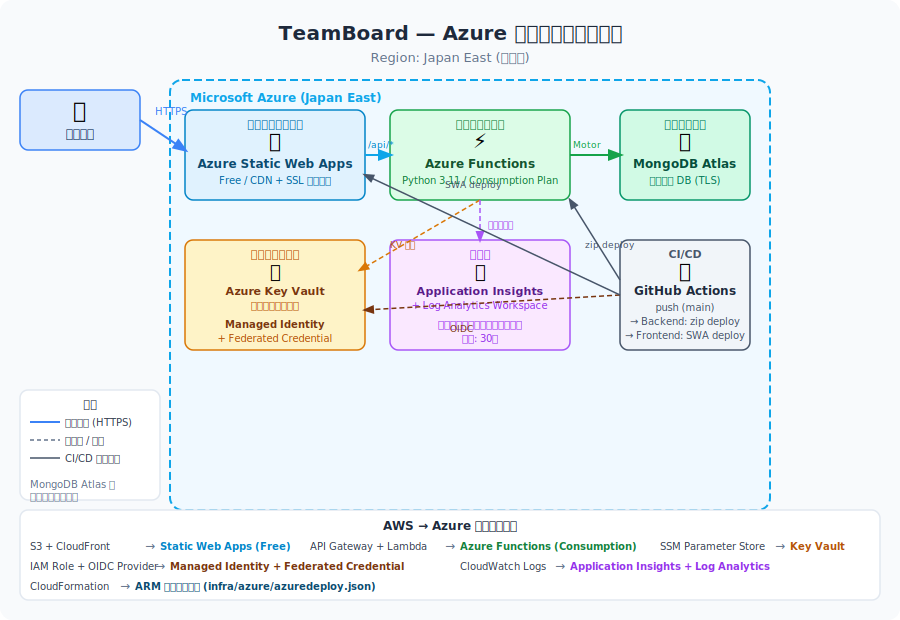
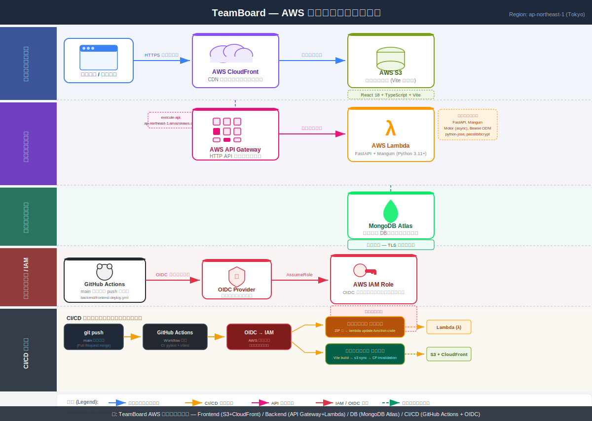

# TeamManagementTool

チームのプロジェクト・メンバー・コストを一元管理する Web アプリケーションです。

---

## アプリケーション概要

**TeamManagementTool (TeamBoard)** は、開発チームのプロジェクト管理・コスト管理を目的とした SPA (Single Page Application) です。

### 主な機能

| 機能 | 説明 |
|------|------|
| ダッシュボード | プロジェクト数・メンバー数・予算消化率などの KPI を一覧表示 |
| メンバー管理 | チームメンバーの登録・編集・削除、月間稼働率の算出 |
| プロジェクト管理 | プロジェクトの作成・編集・削除、進捗・コストのリアルタイム集計 |
| ガントチャート | タスクをドラッグ&ドロップで日程調整できるガントチャート表示 |
| 予算管理 | 予算 vs 実績のグラフ、メンバー別コスト内訳のドーナツチャート |

### 技術スタック

**バックエンド**

- Python 3.x / FastAPI
- MongoDB（Beanie ODM + Motor 非同期ドライバ）
- JWT 認証（python-jose / bcrypt）
- Uvicorn（ASGI サーバ）

**フロントエンド**

- React 19 / TypeScript
- Vite（ビルドツール）
- Tailwind CSS 4
- TanStack Query（サーバー状態管理）
- Zustand（クライアント状態管理）
- React Router DOM 6
- dnd-kit（ドラッグ&ドロップ）
- Recharts（グラフ描画）
- Axios（HTTP クライアント）

### ロールと権限

| ロール | 主な権限 |
|--------|----------|
| admin | 全操作（ユーザー・メンバー・プロジェクト・タスクの作成/編集/削除） |
| manager | プロジェクト・タスクの作成/編集、コスト閲覧 |
| member | プロジェクト・メンバーの閲覧、自担当タスクの進捗更新 |

---

## 環境のセットアップ方法

### 前提条件

- Python 3.11 以上
- Node.js 20 以上 / npm 10 以上
- MongoDB 7.x（ローカルまたはリモート）

### 1. リポジトリのクローン

```bash
git clone <repository-url>
cd TeamManagementTool
```

### 2. バックエンドのセットアップ

```bash
cd backend

# 仮想環境を作成して有効化
python -m venv .venv
source .venv/bin/activate   # Windows: .venv\Scripts\activate

# 依存パッケージをインストール
pip install -r requirements.txt
```

#### 環境変数の設定

`backend/.env` ファイルを作成し、以下の内容を設定してください。

```dotenv
MONGODB_URL=mongodb://localhost:27017
MONGODB_DB_NAME=teamboard
JWT_SECRET_KEY=your-secret-key-change-in-production
JWT_ACCESS_TOKEN_EXPIRE_MINUTES=480
CORS_ORIGINS=http://localhost:5173
```

| 変数名 | デフォルト値 | 説明 |
|--------|------------|------|
| `MONGODB_URL` | `mongodb://localhost:27017` | MongoDB 接続 URL |
| `MONGODB_DB_NAME` | `teamboard` | 使用するデータベース名 |
| `JWT_SECRET_KEY` | *(要変更)* | JWT 署名用シークレットキー |
| `JWT_ACCESS_TOKEN_EXPIRE_MINUTES` | `480` | トークン有効期限（分） |
| `CORS_ORIGINS` | `http://localhost:5173` | フロントエンドの許可オリジン |

### 3. フロントエンドのセットアップ

```bash
cd frontend

# 依存パッケージをインストール
npm install
```

### 4. シードデータの確認

初回起動時にアプリケーションが自動でシードデータを投入します。以下のアカウントでログインできます。

| ユーザー | メールアドレス | パスワード | ロール |
|----------|--------------|-----------|--------|
| 管理者 | `admin@teamboard.example` | `admin1234` | admin |
| マネージャー | `manager@teamboard.example` | `manager1234` | manager |

---

## ビルド方法

### バックエンド

バックエンドは Python スクリプトのため、ビルド手順はありません。

### フロントエンド

本番用静的ファイルをビルドします。

```bash
cd frontend
npm run build
```

ビルド成果物は `frontend/dist/` に出力されます。

ビルド前に型チェックとリントを実行する場合:

```bash
# 型チェック
npx tsc --noEmit

# リント
npm run lint
```

---

## 起動方法

### バックエンドの起動

```bash
cd backend
source .venv/bin/activate   # Windows: .venv\Scripts\activate

uvicorn app.main:app --reload --host 0.0.0.0 --port 8000
```

起動後、以下の URL でアクセスできます。

| URL | 説明 |
|-----|------|
| `http://localhost:8000/api/health` | ヘルスチェック |
| `http://localhost:8000/docs` | Swagger UI（API ドキュメント） |
| `http://localhost:8000/redoc` | ReDoc（API ドキュメント） |

### フロントエンドの起動

**開発サーバ（ホットリロード付き）**

```bash
cd frontend
npm run dev
```

ブラウザで `http://localhost:5173` を開いてください。

**本番ビルドのプレビュー**

```bash
cd frontend
npm run preview
```

### 起動順序

MongoDB → バックエンド → フロントエンド の順で起動してください。

```
[1] MongoDB を起動
[2] バックエンド: uvicorn app.main:app --reload
[3] フロントエンド: npm run dev
```

---

## Azure アーキテクチャ構成

本アプリケーションは **Microsoft Azure** 上にもサーバーレス構成でデプロイできます。



### 構成サービス一覧（Azure）

| レイヤー | Azure サービス | 用途 |
|----------|--------------|------|
| フロントエンド | **Azure Static Web Apps (Free)** | CDN + SSL 自動管理、GitHub Actions deploy 組み込み |
| バックエンド | **Azure Functions (Consumption)** | FastAPI アプリ (AsgiFunctionApp, Python 3.11) |
| データベース | **MongoDB Atlas** | クラウド MongoDB（変更なし） |
| シークレット管理 | **Azure Key Vault** | MONGODB_URL, JWT_SECRET_KEY の安全な管理 |
| 監視 | **Application Insights + Log Analytics** | テレメトリ、ログ、メトリクス |
| CI/CD 認証 | **Managed Identity + Federated Credential** | OIDC による GitHub Actions 認証（シークレット不要） |
| IaC | **ARM テンプレート** | `infra/azure/azuredeploy.json` |

### デプロイフロー（Azure）

```
git push (main) → GitHub Actions
  ├─ バックエンド: OIDC → Azure Login → zip deploy → Azure Functions
  └─ フロントエンド: Azure/static-web-apps-deploy → Static Web Apps
```

詳細な手順は [`docs/azure-deployment.md`](docs/azure-deployment.md) を参照してください。

---

## Azure へのデプロイ手順（ARM テンプレート）

`infra/azure/azuredeploy.json` を使うと、必要な Azure リソースを一括構築できます。

### 前提条件（Azure）

| ツール | バージョン | 確認コマンド |
|--------|-----------|-------------|
| Azure CLI | v2.50 以上 | `az --version` |
| Azure サブスクリプション | — | `az account show` |
| MongoDB Atlas クラスター | — | 接続 URL を手元に用意 |

### ステップ 1 — Entra ID アプリ登録（OIDC 用）

GitHub Actions から Azure への OIDC 認証設定（手動作業）。

```bash
# アプリ登録の作成
az ad app create --display-name "teamboard-github-actions"

# サービスプリンシパルの作成
az ad sp create --id <アプリケーションID>

# フェデレーション資格情報の追加（main ブランチの push のみ認証を通過）
az ad app federated-credential create --id <アプリケーションID> --parameters '{
  "name": "teamboard-main-deploy",
  "issuer": "https://token.actions.githubusercontent.com",
  "subject": "repo:<GitHubOrg>/TeamManagementTool:ref:refs/heads/main",
  "audiences": ["api://AzureADTokenExchange"]
}'
```

**メモする値**:
- アプリケーション（クライアント）ID → `AZURE_CLIENT_ID`
- ディレクトリ（テナント）ID → `AZURE_TENANT_ID`
- サブスクリプション ID → `AZURE_SUBSCRIPTION_ID`

### ステップ 2 — JWT シークレットキーを生成する（Azure）

```bash
openssl rand -hex 32
```

### ステップ 3 — リソースグループ作成 + ARM テンプレートデプロイ

```bash
# リソースグループ作成
az group create --name teamboard-rg --location japaneast

# ARM テンプレートデプロイ
az deployment group create \
  --resource-group teamboard-rg \
  --template-file infra/azure/azuredeploy.json \
  --parameters infra/azure/azuredeploy.parameters.json \
  --parameters \
    mongodbUrl="mongodb+srv://<user>:<password>@<cluster>.mongodb.net/" \
    jwtSecretKey="<ステップ2で生成したキー>"
```

### ステップ 4 — RBAC ロール割り当て

```bash
az role assignment create \
  --assignee <アプリケーションID> \
  --role "Contributor" \
  --scope /subscriptions/<サブスクリプションID>/resourceGroups/teamboard-rg
```

### ステップ 5 — デプロイ結果の確認（Azure）

```bash
az deployment group show \
  --resource-group teamboard-rg \
  --name azuredeploy \
  --query properties.outputs \
  --output table
```

### ステップ 6 — GitHub Secrets を設定する（Azure）

| GitHub Secret 名 | 値の取得元 | 用途 |
|------------------|-----------|------|
| `AZURE_CLIENT_ID` | Entra ID アプリ登録のクライアント ID | OIDC 認証 |
| `AZURE_TENANT_ID` | Entra ID のテナント ID | OIDC 認証 |
| `AZURE_SUBSCRIPTION_ID` | Azure サブスクリプション ID | OIDC 認証 |
| `AZURE_FUNCTIONAPP_NAME` | ARM Output: `functionAppName` | バックエンドデプロイ先 |
| `AZURE_SWA_TOKEN` | `az staticwebapp secrets list --name <SWA名> --query properties.apiKey -o tsv` | フロントエンドデプロイ認証 |
| `VITE_API_URL_AZURE` | ARM Output: `functionAppUrl` | フロントエンドのビルド時 API URL |

### ステップ 7 — 初回デプロイの実行（Azure）

```bash
git commit --allow-empty -m "chore: trigger initial Azure deploy"
git push origin main
```

### 動作確認（Azure）

```bash
# API ヘルスチェック
curl https://<functionAppUrl>/api/health
# → {"status": "ok"} が返れば成功
```

### スタックの削除（Azure）

```bash
# リソースグループごと一括削除（SWA・Functions・Key Vault など全リソース）
az group delete --name teamboard-rg --yes --no-wait
```

> **注意**: Key Vault はソフトデリートが有効なため、同名で再作成する場合は `az keyvault purge` で完全削除してください。

---

## AWS アーキテクチャ構成

本アプリケーションは AWS 上にサーバーレス構成でデプロイされます。



### 構成サービス一覧

| レイヤー | AWS サービス | 用途 |
|----------|-------------|------|
| フロントエンド | **Amazon S3** | React/TypeScript 静的アセットのホスティング |
| フロントエンド | **Amazon CloudFront** | CDN 配信・キャッシュ (ap-northeast-1) |
| バックエンド | **Amazon API Gateway** | HTTP API エンドポイント |
| バックエンド | **AWS Lambda** | FastAPI アプリ (Mangum ASGI, Python 3.11+) |
| データベース | **MongoDB Atlas** | クラウド MongoDB（外部サービス） |
| セキュリティ | **AWS IAM Role (OIDC)** | GitHub Actions 認証（シークレットキー不要） |
| CI/CD | **GitHub Actions** | push to main で自動デプロイ |

### デプロイフロー

```
git push (main) → GitHub Actions → OIDC → IAM Role
  ├─ バックエンド: ZIP 化 → aws lambda update-function-code
  └─ フロントエンド: Vite build → aws s3 sync → CloudFront Invalidation
```

詳細なアーキテクチャ図は [`docs/images/aws-architecture.svg`](docs/images/aws-architecture.svg) を参照してください。

---

## AWS へのデプロイ手順（CloudFormation）

`infra/cloudformation/teamboard.yaml` を使うと、必要な AWS リソースを **1 コマンド**で一括構築できます。

### 前提条件

| ツール | バージョン | 確認コマンド |
|--------|-----------|-------------|
| AWS CLI | v2 以上 | `aws --version` |
| AWS アカウント | — | マネジメントコンソールにログインできること |
| MongoDB Atlas クラスター | — | 接続 URL を手元に用意 |

> **AWS CLI の設定がまだの場合**
> ```bash
> aws configure
> # AWS Access Key ID, Secret Access Key, Region (ap-northeast-1) を入力
> ```

---

### ステップ 1 — JWT シークレットキーを生成する

Lambda 関数が使う JWT 署名キーを事前に生成しておきます。

```bash
# 32バイト以上のランダム文字列を生成（openssl が使える場合）
openssl rand -hex 32
# 出力例: a3f8c2e1d4b5...  ← これを後のコマンドで使用
```

---

### ステップ 2 — CloudFormation スタックをデプロイする

リポジトリのルートで以下のコマンドを実行してください。

```bash
aws cloudformation deploy \
  --template-file infra/cloudformation/teamboard.yaml \
  --stack-name teamboard \
  --region ap-northeast-1 \
  --capabilities CAPABILITY_NAMED_IAM \
  --parameter-overrides \
    GitHubOrg="<あなたの GitHub 組織またはユーザー名>" \
    GitHubRepo="TeamManagementTool" \
    MongodbUrl="mongodb+srv://<user>:<password>@<cluster>.mongodb.net/" \
    JwtSecretKey="<ステップ1で生成したキー>"
```

> **`--capabilities CAPABILITY_NAMED_IAM` が必要な理由**
> テンプレートが名前付き IAM リソース（ロール名を明示的に指定）を作成するため、
> CloudFormation への明示的な許可が必要です。

デプロイ完了まで約 **5〜10 分**かかります。進捗は AWS マネジメントコンソールの
[CloudFormation](https://ap-northeast-1.console.aws.amazon.com/cloudformation) から確認できます。

---

### ステップ 3 — デプロイ結果の値を確認する

スタック作成が完了したら、Outputs に出力された値を確認します。

```bash
aws cloudformation describe-stacks \
  --stack-name teamboard \
  --region ap-northeast-1 \
  --query "Stacks[0].Outputs" \
  --output table
```

以下のような出力が得られます。

```
----------------------------------------------------------
|                    OutputKey                           |
+---------------------------+----------------------------+
| FrontendUrl               | https://xxxx.cloudfront.net|
| ApiUrl                    | https://xxxx.execute-api.. |
| S3BucketName              | teamboard-frontend-123456  |
| CloudFrontDistributionId  | ABCDEF123456               |
| LambdaFunctionName        | teamboard-api              |
| GitHubActionsRoleArn      | arn:aws:iam::123456:role/..|
+---------------------------+----------------------------+
```

---

### ステップ 4 — GitHub Secrets を設定する

GitHub リポジトリの **Settings → Secrets and variables → Actions → New repository secret** から、
ステップ 3 の Outputs を以下の名前で登録します。

| GitHub Secret 名 | CloudFormation Output | 用途 |
|------------------|-----------------------|------|
| `AWS_ROLE_ARN` | `GitHubActionsRoleArn` | OIDC 認証で AssumeRole する IAM ロール |
| `LAMBDA_FUNCTION_NAME` | `LambdaFunctionName` | バックエンドデプロイ対象の Lambda 関数名 |
| `S3_BUCKET_NAME` | `S3BucketName` | フロントエンドアセットのアップロード先 |
| `CLOUDFRONT_DISTRIBUTION_ID` | `CloudFrontDistributionId` | デプロイ後のキャッシュ無効化対象 |
| `VITE_API_URL` | `ApiUrl` | フロントエンドから API を呼び出すベース URL |

---

### ステップ 5 — 初回アプリケーションデプロイを実行する

GitHub Secrets の登録が完了したら、`main` ブランチに空コミットを push して
CI/CD パイプラインを起動します。

```bash
# バックエンドと フロントエンドの両方を強制デプロイ
git commit --allow-empty -m "chore: trigger initial deploy"
git push origin main
```

GitHub の **Actions** タブでパイプラインの完了を確認してください。

---

### ステップ 6 — 動作確認

```bash
# 1. API ヘルスチェック（<ApiUrl> は Outputs の値に置き換え）
curl https://<ApiUrl>/api/health
# → {"status": "ok"} が返れば成功

# 2. フロントエンド URL をブラウザで開く
# Outputs の FrontendUrl をブラウザに貼り付けてログイン画面が表示されれば完了
```

初期ログインアカウント:

| メールアドレス | パスワード | ロール |
|--------------|-----------|--------|
| `admin@teamboard.example` | `admin1234` | admin |
| `manager@teamboard.example` | `manager1234` | manager |

---

### スタックの削除（後片付け）

```bash
# S3 バケットのオブジェクトを先に削除してからスタックを削除する
aws s3 rm s3://$(aws cloudformation describe-stacks \
  --stack-name teamboard --region ap-northeast-1 \
  --query "Stacks[0].Outputs[?OutputKey=='S3BucketName'].OutputValue" \
  --output text) --recursive

# スタック削除
aws cloudformation delete-stack \
  --stack-name teamboard \
  --region ap-northeast-1
```

> **注意**: S3 バケットと CloudWatch ログは `DeletionPolicy: Retain` のため、
> スタック削除後も残ります。不要な場合はマネジメントコンソールから手動で削除してください。
