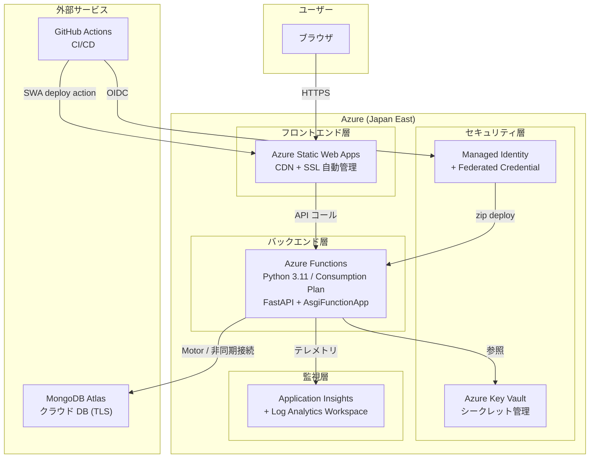

# TeamBoard — Azure デプロイガイド

本ドキュメントは、TeamBoard を **Microsoft Azure** 上にサーバーレス構成でデプロイするための設計・手順・注意点をまとめたものです。

既存の AWS 版と同等の構成を Azure サービスで実現します。データベースは引き続き **MongoDB Atlas** を使用します。

---

## 目次

1. [Azure アーキテクチャ構成](#1-azure-アーキテクチャ構成)
2. [AWS → Azure サービス対応表](#2-aws--azure-サービス対応表)
3. [アーキテクチャ設計の判断根拠](#3-アーキテクチャ設計の判断根拠)
4. [ARM テンプレート設計](#4-arm-テンプレート設計)
5. [Azure Functions バックエンド対応](#5-azure-functions-バックエンド対応)
6. [GitHub Actions ワークフロー設計](#6-github-actions-ワークフロー設計)
7. [Azure Portal 設定ガイド](#7-azure-portal-設定ガイド)
8. [デプロイ手順 (az CLI)](#8-デプロイ手順-az-cli)
9. [GitHub Secrets 設定](#9-github-secrets-設定)
10. [動作確認](#10-動作確認)
11. [スタック削除手順](#11-スタック削除手順)
12. [MongoDB Atlas ネットワーク設定](#12-mongodb-atlas-ネットワーク設定)
13. [AWS 版との差分まとめ — 注意点・ハマりどころ](#13-aws-版との差分まとめ--注意点ハマりどころ)
14. [作業分担マトリクス (PL→SE 割り振り用)](#14-作業分担マトリクス-plse-割り振り用)
15. [成果物一覧](#15-成果物一覧)

---

## 1. Azure アーキテクチャ構成



### データフロー概要

```
[リクエスト]
ユーザー → Static Web Apps (CDN + SSL) → 静的アセット返却
                                       → /api/* → Azure Functions → MongoDB Atlas

[CI/CD]
git push (main) → GitHub Actions
  ├─ Backend:  OIDC → Azure Login → zip deploy → Azure Functions
  └─ Frontend: Azure/static-web-apps-deploy → SWA
```

**リージョン**: `japaneast` (東日本)

---

## 2. AWS → Azure サービス対応表

| レイヤー | AWS サービス | Azure サービス | 備考 |
|---------|-------------|---------------|------|
| フロントエンド (静的ホスティング) | S3 (静的ウェブホスティング) | **Static Web Apps (Free)** | CDN・SSL・カスタムドメインが一体化 |
| フロントエンド (CDN) | CloudFront | Static Web Apps に統合 | 別リソース不要 |
| バックエンド (API ルーティング) | API Gateway v2 (HTTP API) | Azure Functions HTTP トリガー | Functions 自体がエンドポイントを持つ |
| バックエンド (コンピュート) | Lambda (Python 3.11) | **Azure Functions (Consumption Plan, Python 3.11)** | コールドスタート特性が異なる（後述） |
| バックエンド (ASGI アダプター) | Mangum | **AsgiFunctionApp** (`azure-functions` パッケージ) | エントリポイントの書き換えが必要 |
| シークレット管理 | SSM Parameter Store | **Azure Key Vault** | RBAC ベースのアクセス制御 |
| ログ・監視 | CloudWatch Logs | **Application Insights + Log Analytics** | |
| CI/CD 認証 | IAM Role + OIDC Provider | **Managed Identity + Federated Credential** | |
| IaC | CloudFormation | **ARM テンプレート** | |
| データベース | MongoDB Atlas | MongoDB Atlas | **変更なし** |

---

## 3. アーキテクチャ設計の判断根拠

### 3.1 なぜ Static Web Apps を選んだか

フロントエンドのホスティングには、以下の選択肢を検討した上で **Static Web Apps (SWA)** を採用した。

| 選択肢 | メリット | デメリット | 判定 |
|--------|---------|-----------|------|
| **Storage Account + Azure CDN** | AWS 構成 (S3 + CloudFront) と 1:1 対応で分かりやすい | リソースが 3 つ必要 (Storage Account + CDN Profile + CDN Endpoint)。SSL 設定が手動。ARM テンプレートが冗長になる | ❌ |
| **Static Web Apps (Free)** | 1 リソースで CDN + SSL + カスタムドメインが完結。GitHub Actions デプロイが組み込みアクション。Free プランで 100GB/月帯域 | マネージド Functions は制限が多い (ルーティング等) | ✅ 採用 |

**ポイント**: SWA のマネージド Functions (API 統合) は使わない。FastAPI のフルルーティングが必要なため、**スタンドアロンの Azure Functions** を別リソースとしてデプロイし、SWA の linked backend としては接続しない。フロントエンドの `VITE_API_URL` で Functions の URL を直接指定する。

### 3.2 Azure Functions の注意点

#### コールドスタート

- AWS Lambda と同様、Consumption Plan ではコールドスタートが発生する
- Python ランタイムは Node.js より起動が遅い傾向がある
- 対策が必要な場合は **Premium Plan (EP1)** へ変更し、常時インスタンスを 1 つ確保する。ただしコストが月額 $150 程度に跳ね上がるため、まずは Consumption Plan で検証すること

#### ASGI 統合

AWS Lambda では `Mangum` を使っているが、Azure Functions では **`azure-functions` パッケージ v2 の `AsgiFunctionApp`** を使う。

- `function_app.py` を `backend/` 直下に新規作成する
- 既存の `app.main` の FastAPI インスタンスをラップするだけで、ルーティングやミドルウェアはすべて FastAPI 側で処理される
- `host.json` でルーティングプレフィックスを空にして、FastAPI のパスがそのまま使えるようにする

**重要**: `host.json` の `extensions.http.routePrefix` を `""` (空文字) に設定すること。デフォルトの `"api"` のままだと、すべてのルートが `/api/api/health` のように二重プレフィックスになる。

#### 環境変数

- AWS Lambda では CloudFormation から直接環境変数を設定しているが、Azure Functions では **アプリケーション設定 (Application Settings)** に設定する
- ARM テンプレートの `Microsoft.Web/sites` リソースの `siteConfig.appSettings` で定義する
- Key Vault 参照も可能: `@Microsoft.KeyVault(SecretUri=https://vault-name.vault.azure.net/secrets/secret-name/)` 形式

### 3.3 OIDC 認証 (GitHub Actions → Azure)

AWS では IAM OIDC Provider + IAM Role の組み合わせだが、Azure では以下の構成になる:

1. **Microsoft Entra ID (旧 Azure AD) アプリ登録** — サービスプリンシパルを作成
2. **フェデレーション資格情報 (Federated Identity Credential)** — GitHub Actions の OIDC トークンを信頼する設定を追加
3. **RBAC ロール割り当て** — サービスプリンシパルに対してリソースグループスコープの `Contributor` ロールを付与

**AWS との主要な差分**:
- AWS: 1 つの IAM Role にインラインポリシーで個別権限 (lambda:UpdateFunctionCode, s3:PutObject 等) を最小権限で付与
- Azure: `Contributor` ロール (リソースグループスコープ) を付与するのが一般的。より細かく制御したい場合はカスタムロールを定義する

**注意**: ARM テンプレートでは Entra ID アプリ登録とフェデレーション資格情報の作成が **できない** (ARM は Azure Resource Manager リソースのみ対象、Entra ID は Microsoft Graph API の管轄)。そのため、この部分は **Azure Portal または az CLI で事前に手動設定** する必要がある。これは AWS の CloudFormation が OIDC Provider と IAM Role の両方を 1 テンプレートで作成できる点と大きく異なる。

---

## 4. ARM テンプレート設計

### 4.1 ファイル配置

```
infra/azure/
├── azuredeploy.json            # ARM テンプレート本体
└── azuredeploy.parameters.json  # パラメータファイル (サンプル値)
```

### 4.2 パラメータ設計

CloudFormation テンプレートと対応するパラメータを用意する。

| パラメータ名 | 型 | デフォルト | 説明 | CF 対応 |
|-------------|---|-----------|------|---------|
| `projectName` | string | `teamboard` | リソース名プレフィックス (英小文字・数字・ハイフン、2〜20文字) | `ProjectName` |
| `location` | string | `japaneast` | デプロイリージョン | (固定: ap-northeast-1) |
| `mongodbUrl` | securestring | — | MongoDB Atlas 接続 URL | `MongodbUrl` |
| `mongodbDbName` | string | `teamboard` | MongoDB データベース名 | `MongodbDbName` |
| `jwtSecretKey` | securestring | — | JWT 署名シークレットキー (32文字以上) | `JwtSecretKey` |
| `jwtAlgorithm` | string | `HS256` | JWT 署名アルゴリズム | `JwtAlgorithm` |
| `jwtExpireMinutes` | int | `480` | JWT トークン有効期限 (分) | `JwtExpireMinutes` |
| `allowedEmails` | string | `""` | ログイン許可メール (カンマ区切り) | `AllowedEmails` |
| `corsOrigins` | string | — | フロントエンド URL (SWA デプロイ後に設定) | (CF は CloudFront ドメインを自動参照) |
| `logRetentionDays` | int | `30` | ログ保持期間 (日) | `LogRetentionDays` |

**注意**: `securestring` 型のパラメータは ARM デプロイ時に自動的にマスクされ、Azure Portal やデプロイ履歴に平文で表示されない。AWS CloudFormation の `NoEcho: true` に相当する。

### 4.3 リソース一覧と作成順序

ARM テンプレートで以下のリソースを定義する。`dependsOn` で依存関係を明示すること。

```
1. Log Analytics Workspace          ← 依存なし
2. Application Insights             ← 1 に依存
3. Storage Account (Functions 用)   ← 依存なし (※ SWA 用ではない)
4. App Service Plan (Consumption)   ← 依存なし
5. Key Vault                        ← 依存なし
6. Azure Functions (Function App)   ← 2, 3, 4, 5 に依存
7. Key Vault シークレット            ← 5 に依存
8. Static Web Apps                  ← 依存なし
```

**重要ポイント**:

- **Storage Account は Azure Functions 内部用**。Functions の Consumption Plan は内部状態管理用に Storage Account を必要とする。これはフロントエンド用ではない (フロントエンドは SWA が管理)
- **Key Vault のアクセスポリシー**: Functions の System Assigned Managed Identity に対して `get` + `list` シークレット権限を付与する。ARM テンプレートでは `Microsoft.KeyVault/vaults/accessPolicies` リソースで設定するか、RBAC モデル (`enableRbacAuthorization: true`) を使う。RBAC モデルの方がモダンだが、`Key Vault Secrets User` ロール割り当てが必要
- **CORS**: Azure Functions 側の CORS 設定は `siteConfig.cors.allowedOrigins` で SWA の URL を許可する。ただし SWA の URL はデプロイするまで分からないため、初回デプロイ後に `az functionapp cors add` で追加するか、ARM テンプレートのパラメータ `corsOrigins` で指定する

### 4.4 Outputs 設計

ARM テンプレートの `outputs` セクションで、GitHub Secrets に登録する値を出力する。

| Output 名 | 値 | GitHub Secret への対応 |
|-----------|---|----------------------|
| `functionAppName` | Functions アプリ名 | `AZURE_FUNCTIONAPP_NAME` |
| `functionAppUrl` | `https://<name>.azurewebsites.net` | `VITE_API_URL` (Azure 用) |
| `staticWebAppName` | SWA リソース名 | (参考情報) |
| `staticWebAppUrl` | SWA の既定 URL | ブラウザアクセス確認用 |
| `keyVaultName` | Key Vault 名 | (参考情報) |
| `resourceGroupName` | リソースグループ名 | (参考情報) |

---

## 5. Azure Functions バックエンド対応

### 5.1 新規作成ファイル

| ファイル | 配置先 | 目的 |
|---------|-------|------|
| `function_app.py` | `backend/` | Azure Functions v2 プログラミングモデルのエントリポイント。FastAPI app を `AsgiFunctionApp` でラップ |
| `host.json` | `backend/` | Functions ホスト設定。**`routePrefix` を空文字に設定する** のが最重要 |
| `local.settings.json` | `backend/` | ローカル開発用の設定ファイル (`.gitignore` に追加すること) |
| `requirements-azure.txt` | `backend/` | `requirements.txt` の内容 + `azure-functions>=1.17.0` を追加。Mangum は不要 |

### 5.2 実装上の注意

#### `function_app.py`

- `AsgiFunctionApp` は Azure Functions v2 プログラミングモデル (Python v2) で提供される
- `http_auth_level` は `ANONYMOUS` にする (認証は FastAPI 側の JWT で処理するため)
- 既存の `app/main.py` の `handler = Mangum(app)` は AWS 専用なので、Azure Functions からは `app` オブジェクトを直接インポートする

#### `host.json`

```json
{
  "version": "2.0",
  "extensions": {
    "http": {
      "routePrefix": ""
    }
  }
}
```

`routePrefix` を空文字にしないと、FastAPI の全ルートに `/api` が自動付与される。本アプリは FastAPI ルーター側で既に `/api` プレフィックスを付けているため、二重にならないよう注意。

#### `local.settings.json`

- `FUNCTIONS_WORKER_RUNTIME`: `python` を指定
- `AzureWebJobsStorage`: ローカル開発時は `UseDevelopmentStorage=true` (Azure Storage Emulator) または実際の Storage Account 接続文字列
- アプリケーション環境変数 (`MONGODB_URL`, `JWT_SECRET_KEY` 等) もここに記載する

#### 既存コードへの影響

- `backend/app/` 配下のコードは **一切変更しない** 。`function_app.py` が `app.main` の FastAPI インスタンスをインポートするだけ
- `Mangum` は AWS Lambda 用のエントリポイントなので、Azure Functions では使わない。ただし `app/main.py` の `handler = Mangum(app)` 行は削除しなくてよい (Azure Functions は `function_app.py` をエントリポイントとして使うため、`main.py` の Mangum 行は単に無視される)

---

## 6. GitHub Actions ワークフロー設計

### 6.1 バックエンドデプロイ (`.github/workflows/backend-deploy-azure.yml`)

**フロー**:
```
main push (backend/**) → checkout → setup-python 3.11
  → pip install (requirements-azure.txt) → zip 化
  → azure/login (OIDC) → az functionapp deployment source config-zip
```

**AWS 版との差分**:
- AWS: `aws-actions/configure-aws-credentials` → `aws lambda update-function-code`
- Azure: `azure/login` (OIDC) → `az functionapp deployment source config-zip`

**注意点**:
- `azure/login@v2` で OIDC 認証を使う場合、`permissions` に `id-token: write` が必要 (AWS 版と同じ)
- ログインに必要な 3 つの値: `client-id`, `tenant-id`, `subscription-id` を GitHub Secrets に設定
- ZIP 化時のディレクトリ構成: `function_app.py` と `host.json` が ZIP のルートに来るようにする。`app/` ディレクトリもルート直下に含める
- `requirements-azure.txt` を使うこと (`requirements.txt` には Mangum が含まれている。Azure では不要だが、あっても害はない。ただし `requirements-azure.txt` を分けておくと意図が明確)

### 6.2 フロントエンドデプロイ (`.github/workflows/frontend-deploy-azure.yml`)

**フロー**:
```
main push (frontend/**) → checkout → Azure/static-web-apps-deploy@v1
```

**AWS 版との差分**:
- AWS: `npm ci` → `npm run build` → `aws s3 sync` → `cloudfront create-invalidation` (4 ステップ)
- Azure: `Azure/static-web-apps-deploy@v1` が **ビルド + デプロイ + CDN パージを 1 アクションで実行** (1 ステップ)

**注意点**:
- SWA deploy アクションには `azure_static_web_apps_api_token` が必要。これは SWA リソース作成時に発行されるデプロイトークン
- `app_location` には `frontend` を指定 (ソースコードのルート)
- `output_location` には `dist` を指定 (Vite のビルド出力先)
- `api_location` は **空にする** (バックエンドは別の Azure Functions で提供するため)
- ビルド時の環境変数 `VITE_API_URL` は SWA の環境変数設定 (`staticwebapp.config.json` または Azure Portal) で設定する

**注意**: OIDC 認証は **不要**。SWA deploy アクションは独自のデプロイトークンで認証するため、`azure/login` ステップは要らない。これは AWS 版 (OIDC でログインしてから `aws s3 sync`) と異なるポイント。

---

## 7. Azure Portal 設定ガイド

ARM テンプレートでは自動化 **できない** 設定を Azure Portal (または az CLI) で手動設定する。

### 7.1 Entra ID アプリ登録 (GitHub Actions OIDC 用)

**なぜ手動なのか**: ARM テンプレートは Azure Resource Manager (ARM) リソースのみ対象。Entra ID (Azure AD) リソースは Microsoft Graph API の管轄であり、ARM テンプレートでは作成できない。

**手順概要**:

1. Azure Portal → **Microsoft Entra ID** → **アプリの登録** → **新規登録**
2. アプリ名: `teamboard-github-actions` (任意)
3. サポートされるアカウントの種類: **この組織ディレクトリのみ** (シングルテナント)
4. 登録後、**アプリケーション (クライアント) ID** と **ディレクトリ (テナント) ID** をメモする → GitHub Secrets に使用

### 7.2 フェデレーション資格情報の追加

1. 作成したアプリ登録 → **証明書とシークレット** → **フェデレーション資格情報** タブ → **資格情報の追加**
2. フェデレーション資格情報のシナリオ: **GitHub Actions で Azure リソースをデプロイする**
3. 設定値:

| フィールド | 値 |
|-----------|---|
| 組織 | `<GitHub 組織名 or ユーザー名>` |
| リポジトリ | `TeamManagementTool` |
| エンティティの種類 | **ブランチ** |
| ブランチ名 | `main` |
| 名前 | `teamboard-main-deploy` |

**注意**: エンティティの種類で「ブランチ」を選び、`main` を指定すること。これにより `main` ブランチへの push のみが OIDC 認証を通過する。AWS の IAM Role の `Condition` で `refs/heads/main` を指定しているのと同等。

### 7.3 サービスプリンシパルへの RBAC ロール割り当て

1. Azure Portal → **リソースグループ** → 対象のリソースグループ → **アクセス制御 (IAM)** → **ロールの割り当ての追加**
2. ロール: **共同作成者 (Contributor)**
3. メンバー: 上記で作成したアプリ登録のサービスプリンシパルを検索して選択

**AWS との差分**: AWS では `lambda:UpdateFunctionCode` 等の個別権限を最小権限で付与しているが、Azure では `Contributor` ロールが一般的。最小権限にしたい場合は、カスタムロールで `Microsoft.Web/sites/write` と `Microsoft.Web/sites/extensions/write` に限定することも可能だが、運用コストとのバランスを考慮すること。

### 7.4 Key Vault アクセス設定

ARM テンプレートで Key Vault を作成し、Functions の System Assigned Managed Identity にアクセス権を付与する設定は ARM テンプレート内で完結する。

ただし、**RBAC モデルを使う場合** は ARM テンプレートデプロイ後に Functions の Managed Identity の ObjectId を取得してロール割り当てを行う必要があるため、az CLI コマンドが追加で必要になる場合がある。アクセスポリシーモデルであれば ARM テンプレート内で完結する。

→ **推奨**: 初回はアクセスポリシーモデル (`enableRbacAuthorization: false`) で実装し、運用が安定したら RBAC モデルに移行する。

---

## 8. デプロイ手順 (az CLI)

### 前提条件

| ツール | バージョン | 確認コマンド |
|--------|-----------|-------------|
| Azure CLI | v2.50 以上 | `az --version` |
| Azure サブスクリプション | — | `az account show` で確認 |
| MongoDB Atlas クラスター | — | 接続 URL を手元に用意 |

```bash
# Azure CLI のインストール (未インストールの場合)
curl -sL https://aka.ms/InstallAzureCLIDeb | sudo bash

# ログイン
az login

# サブスクリプションの確認・設定
az account show
az account set --subscription "<サブスクリプションID>"
```

### ステップ 1 — Entra ID アプリ登録 (OIDC 用)

[7.1 〜 7.3 の手順を先に実施する](#71-entra-id-アプリ登録-github-actions-oidc-用)

az CLI で実施する場合:
```bash
# アプリ登録の作成
az ad app create --display-name "teamboard-github-actions"

# サービスプリンシパルの作成
az ad sp create --id <アプリケーションID>

# フェデレーション資格情報の追加
az ad app federated-credential create --id <アプリケーションID> --parameters '{
  "name": "teamboard-main-deploy",
  "issuer": "https://token.actions.githubusercontent.com",
  "subject": "repo:<GitHubOrg>/TeamManagementTool:ref:refs/heads/main",
  "audiences": ["api://AzureADTokenExchange"]
}'
```

**ここでメモする値**:
- アプリケーション (クライアント) ID → `AZURE_CLIENT_ID`
- ディレクトリ (テナント) ID → `AZURE_TENANT_ID`
- サブスクリプション ID → `AZURE_SUBSCRIPTION_ID`

### ステップ 2 — JWT シークレットキーの生成

```bash
openssl rand -hex 32
```

### ステップ 3 — リソースグループ作成 + ARM テンプレートデプロイ

```bash
# リソースグループ作成
az group create --name teamboard-rg --location japaneast

# ARM テンプレートデプロイ
az deployment group create \
  --resource-group teamboard-rg \
  --template-file infra/azure/azuredeploy.json \
  --parameters infra/azure/azuredeploy.parameters.json \
  --parameters \
    mongodbUrl="mongodb+srv://<user>:<password>@<cluster>.mongodb.net/" \
    jwtSecretKey="<ステップ2で生成したキー>"
```

**AWS との差分**: CloudFormation は `--capabilities CAPABILITY_NAMED_IAM` が必要だが、ARM テンプレートにはそのような承認フラグは不要。ただし ARM は Entra ID リソースを扱えないため、ステップ 1 を手動で先に行う必要がある。

### ステップ 4 — RBAC ロール割り当て

```bash
# サービスプリンシパルにリソースグループの Contributor ロールを割り当て
az role assignment create \
  --assignee <アプリケーションID> \
  --role "Contributor" \
  --scope /subscriptions/<サブスクリプションID>/resourceGroups/teamboard-rg
```

### ステップ 5 — デプロイ結果の確認

```bash
az deployment group show \
  --resource-group teamboard-rg \
  --name azuredeploy \
  --query properties.outputs \
  --output table
```

### ステップ 6 — GitHub Secrets の設定

[9. GitHub Secrets 設定](#9-github-secrets-設定) を参照して設定する。

### ステップ 7 — 初回デプロイの実行

```bash
git commit --allow-empty -m "chore: trigger initial Azure deploy"
git push origin main
```

---

## 9. GitHub Secrets 設定

### Azure 用 (新規追加)

| GitHub Secret 名 | 値の取得元 | 用途 |
|------------------|-----------|------|
| `AZURE_CLIENT_ID` | Entra ID アプリ登録のクライアント ID | OIDC 認証 |
| `AZURE_TENANT_ID` | Entra ID のテナント ID | OIDC 認証 |
| `AZURE_SUBSCRIPTION_ID` | Azure サブスクリプション ID | OIDC 認証 |
| `AZURE_FUNCTIONAPP_NAME` | ARM テンプレート Output: `functionAppName` | バックエンドデプロイ先 |
| `AZURE_SWA_TOKEN` | SWA リソースのデプロイトークン | フロントエンドデプロイ認証 |
| `VITE_API_URL_AZURE` | ARM テンプレート Output: `functionAppUrl` | フロントエンドのビルド時 API URL |

### SWA デプロイトークンの取得

```bash
az staticwebapp secrets list --name <SWAリソース名> --query properties.apiKey -o tsv
```

**AWS 版との差分**:
- AWS: `AWS_ROLE_ARN` 1 つで OIDC 認証が完結
- Azure: `AZURE_CLIENT_ID`, `AZURE_TENANT_ID`, `AZURE_SUBSCRIPTION_ID` の 3 つが必要

---

## 10. 動作確認

```bash
# 1. API ヘルスチェック
curl https://<functionAppUrl>/api/health
# → {"status": "ok"} が返れば成功

# 2. フロントエンド URL をブラウザで開く
# ARM テンプレート Outputs の staticWebAppUrl をブラウザに貼り付け
# ログイン画面が表示されれば成功
```

初期ログインアカウントは AWS 版と同じ:

| メールアドレス | パスワード | ロール |
|--------------|-----------|--------|
| `admin@teamboard.example` | `admin1234` | admin |
| `manager@teamboard.example` | `manager1234` | manager |

---

## 11. スタック削除手順

AWS と異なり、Azure はリソースグループ単位で一括削除できるため非常にシンプル。

```bash
az group delete --name teamboard-rg --yes --no-wait
```

**AWS との差分**:
- AWS: S3 バケットの中身を先に削除しないとスタック削除が失敗する (`DeletionPolicy: Retain` のため)
- Azure: リソースグループ削除で **全リソースが一括削除** される。SWA 内のコンテンツも Storage Account も Key Vault もすべて消える

**注意**: Key Vault はソフトデリート (論理削除) が有効な場合、完全削除まで 7〜90 日かかる。同名の Key Vault を再作成する際にエラーになる場合は、`az keyvault purge` で完全削除する。

---

## 12. MongoDB Atlas ネットワーク設定

Azure Functions (Consumption Plan) は **共有送信 IP** を使用するため、MongoDB Atlas の IP アクセスリストの管理が AWS Lambda と同様に課題になる。

### 対応方法

| 方法 | 手順 | セキュリティ |
|------|------|-------------|
| **`0.0.0.0/0` で全開放** | MongoDB Atlas → Network Access → `0.0.0.0/0` を追加 | ❌ 最も簡単だが非推奨。パスワード認証のみの保護 |
| **Azure リージョンの IP 範囲を追加** | Azure の公開 IP 範囲一覧から Japan East の範囲を追加 | △ 範囲が広い |
| **Private Endpoint (VNet 統合)** | Functions Premium Plan + VNet 統合 + MongoDB Atlas Private Link | ✅ 最もセキュア。ただし Consumption Plan では不可 |

**推奨**: 開発・検証環境では `0.0.0.0/0` で開始し、本番環境では Premium Plan + Private Endpoint を検討する。これは AWS Lambda の場合 (VPC Lambda + PrivateLink) と同じ考え方。

---

## 13. AWS 版との差分まとめ — 注意点・ハマりどころ

### 最もハマりやすいポイント

| # | 問題 | 詳細 | 対策 |
|---|------|------|------|
| 1 | **`routePrefix` の二重プレフィックス** | Azure Functions のデフォルト `routePrefix` は `"api"` で、FastAPI のルートに `/api` を付けているため `/api/api/health` になる | `host.json` で `routePrefix: ""` を設定 |
| 2 | **ARM で Entra ID リソースが作れない** | OIDC 設定が ARM テンプレート内で完結しない | ステップ 1 で手動作成。スクリプト化する場合は `az ad` コマンドを使う |
| 3 | **SWA と Functions の CORS** | SWA からスタンドアロン Functions を呼ぶ際、CORS 設定が必要 | Functions の CORS 設定に SWA の URL を追加 |
| 4 | **Consumption Plan のコールドスタート** | Python ランタイムは Node.js より起動が遅い | 初回アクセス時に 5〜15 秒かかる場合がある。許容できない場合は Premium Plan |
| 5 | **zip deploy のディレクトリ構成** | `function_app.py` が ZIP ルートにないとデプロイ失敗 | GitHub Actions の ZIP 作成ステップで構成を確認 |
| 6 | **Key Vault ソフトデリート** | 削除後の再作成でエラー | `az keyvault purge` で完全削除してから再作成 |

### AWS と Azure の運用上の違い

| 項目 | AWS | Azure |
|------|-----|-------|
| IaC のスコープ | CloudFormation 1 つで IAM + インフラ全部 | ARM テンプレート (インフラ) + az ad コマンド (Entra ID) に分離 |
| フロントエンドデプロイ | `aws s3 sync` + `cloudfront create-invalidation` | SWA deploy アクション 1 つ |
| シークレット管理 | SSM Parameter Store (環境変数として直接設定) | Key Vault (Key Vault 参照構文 or アプリ設定に直接設定) |
| ログ確認 | `aws logs tail` | `az monitor app-insights query` or Azure Portal |
| リソース削除 | S3 中身削除 → スタック削除 (残存リソースあり) | `az group delete` で完全一括削除 |

---

## 14. 作業分担マトリクス (PL→SE 割り振り用)

### フェーズ 1: 基盤準備 (並行作業可能)

| タスク ID | タスク | 成果物 | 担当 | 依存 | 並行可否 |
|-----------|--------|--------|------|------|---------|
| A-1 | ARM テンプレート作成 | `infra/azure/azuredeploy.json` | SE-A | なし | ✅ 並行可 |
| A-2 | ARM パラメータファイル作成 | `infra/azure/azuredeploy.parameters.json` | SE-A | A-1 | ❌ A-1 完了後 |
| B-1 | Azure Functions エントリポイント作成 | `backend/function_app.py` | SE-B | なし | ✅ 並行可 |
| B-2 | Azure Functions 設定ファイル作成 | `backend/host.json`, `backend/local.settings.json` | SE-B | なし | ✅ 並行可 |
| B-3 | Azure 用 requirements 作成 | `backend/requirements-azure.txt` | SE-B | なし | ✅ 並行可 |
| C-1 | Azure アーキテクチャ図 SVG 作成 | `docs/images/azure-architecture.svg` | SE-C | なし | ✅ 並行可 |

### フェーズ 2: CI/CD (フェーズ 1 の一部完了後)

| タスク ID | タスク | 成果物 | 担当 | 依存 | 並行可否 |
|-----------|--------|--------|------|------|---------|
| D-1 | バックエンドデプロイ WF 作成 | `.github/workflows/backend-deploy-azure.yml` | SE-A or SE-B | B-1, B-2, B-3 | ✅ D-2 と並行可 |
| D-2 | フロントエンドデプロイ WF 作成 | `.github/workflows/frontend-deploy-azure.yml` | SE-A or SE-B | なし | ✅ D-1 と並行可 |

### フェーズ 3: 統合 (フェーズ 2 完了後)

| タスク ID | タスク | 成果物 | 担当 | 依存 | 並行可否 |
|-----------|--------|--------|------|------|---------|
| E-1 | README.md に Azure セクション追加 | `README.md` | SE-C | A-1, C-1 | ❌ A-1, C-1 完了後 |
| E-2 | 全体レビュー・動作確認 | — | 全員 | 全タスク | ❌ 最後 |

### 依存関係図

```
[フェーズ1: 並行]          [フェーズ2]           [フェーズ3]
A-1 (ARM) ──────────→ A-2 (params)
                      ├──────────────────────→ E-1 (README)
B-1 (function_app) ─┐                                    ──→ E-2 (レビュー)
B-2 (host.json)   ──┼→ D-1 (backend WF)
B-3 (requirements) ─┘
                       D-2 (frontend WF) ← 依存なし
C-1 (アーキテクチャ図) ────────────────────→ E-1 (README)
```

### 最大効率の割り振りパターン (3 SE)

| SE | フェーズ 1 | フェーズ 2 | フェーズ 3 |
|----|-----------|-----------|-----------|
| **SE-A** | A-1 → A-2 | D-1 | E-2 (レビュー) |
| **SE-B** | B-1 + B-2 + B-3 | D-2 | E-2 (レビュー) |
| **SE-C** | C-1 | — | E-1 → E-2 (レビュー) |

---

## 15. 成果物一覧

| # | ファイル | 操作 | 概要 |
|---|---------|------|------|
| 1 | `infra/azure/azuredeploy.json` | 新規 | ARM テンプレート |
| 2 | `infra/azure/azuredeploy.parameters.json` | 新規 | ARM パラメータサンプル |
| 3 | `backend/function_app.py` | 新規 | Azure Functions ASGI エントリポイント |
| 4 | `backend/host.json` | 新規 | Azure Functions ホスト設定 |
| 5 | `backend/local.settings.json` | 新規 | Azure Functions ローカル開発設定 |
| 6 | `backend/requirements-azure.txt` | 新規 | Azure Functions 用依存パッケージ |
| 7 | `.github/workflows/backend-deploy-azure.yml` | 新規 | バックエンド Azure デプロイ WF |
| 8 | `.github/workflows/frontend-deploy-azure.yml` | 新規 | フロントエンド Azure デプロイ WF |
| 9 | `docs/images/azure-architecture.svg` | 新規 | Azure アーキテクチャ図 |
| 10 | `README.md` | 編集 | Azure デプロイセクション追加 |
